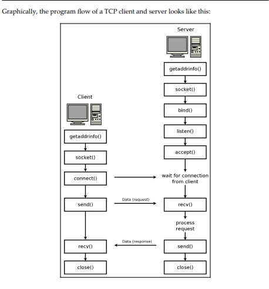
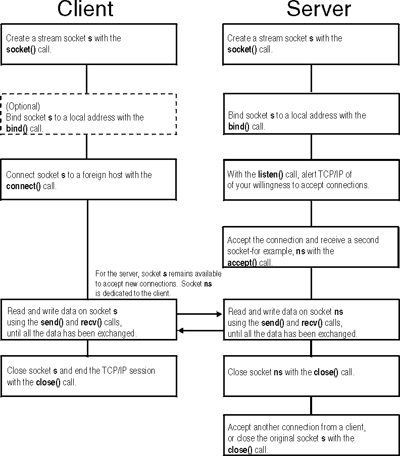
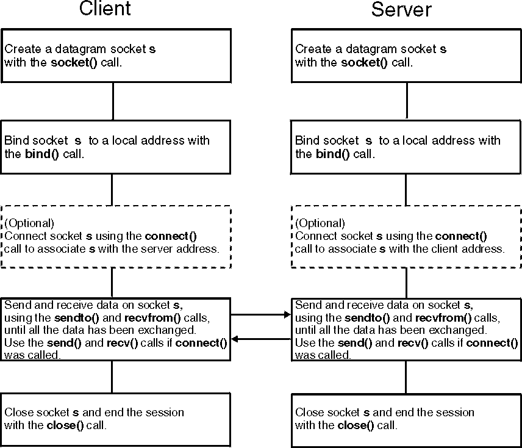

# webserv
A HTTP server in C++ 98

## Hands on Network Programming with C

### TCP program flow
A TCP server listens for connections at a particular port number on a particular interface.
The program must first initialize a struct addrinfo structure with the proper listening
IP address and port number. The getaddrinfo() function is helpful so that you can do
this in an IPv4/IPv6 independent way. The server then creates the socket with a call to
socket(). The socket must be bound to the listening IP address and port. This is
accomplished with a call to bind().



### Socket functions
The socket APIs provide many functions for use in network programming. Here are the common socket functions that we use in this book:

- `socket()` creates and initializes a new socket.
- `bind()` associates a socket with a particular local IP address and port number.
- `listen()` is used on the server to cause a TCP socket to listen for new connections.
- `connect()` is used on the client to set the remote address and port. In the case of TCP, it also establishes a connection.
- `accept()` is used on the server to create a new socket for an incoming TCP connection.
- `send()` and `recv()` are used to send and receive data with a socket.
- `close()` (Berkeley sockets) and closesocket() (Winsock sockets) are used to close a socket. In the case of TCP, this also terminates the connection.
- `select()` is used to wait for an event on one or more sockets.
- `getnameinfo()` and `getaddrinfo()` provide a protocol-independent manner of working with hostnames and addresses.
- `setsockopt()` is used to change some socket options.
- `fcntl()` (Berkeley sockets) and ioctlsocket() (Winsock sockets) are also used to get and set some socket options.

You may see some Berkeley socket networking programs using read() and write(). These functions don't port to Winsock, so we prefer send() and recv() here. Some other common functions that are used with Berkeley sockets are poll() and dup(). We will avoid these in order to keep our programs portable.

Other differences between Berkeley sockets and Winsock sockets are addressed later in this
chapter.

Now that we have an idea of the functions involved, let's consider program design and
flow next.

## IBM

TCP/IP is an internetworking technology and is named after its two main protocols: Transmission Control Protocol (TCP), and Internet Protocol (IP). You should also be familiar with the following basic internetworking terms:<br>

**client**<br>
A process that requests services on the network.

**server**<br>
A process that responds to a request for service from a client.

**datagram**<br>
A basic unit of information, consisting of one or more data packets, which are passed across an internet at the transport level.
**packet**<br>
The unit or block of a data transaction between a computer and its network. A packet usually contains a network header, at least one high-level protocol header, and data blocks. Generally, the format of data blocks does not affect how packets are handled. Packets are the exchange medium used at the Internetwork layer to send data through the network.

## What is a socket?

A `socket` can be thought of as an endpoint in a two-way communication channel. Socket routines create the communication channel, and the channel carries data between application programs either locally or over networks. Each socket open by a process — like any open file in a POSIX process — has a unique (within the process) number associated with it called a “`file descriptor`”, an integer that designates a socket and allows the application program to refer to it when needed.

### Address Families

#### AF_INET and AF_INET6
`AF_INET` and `AF_INET6` (internet domain) sockets provide a means of communicating between application programs that are on different systems using the `TCP` and `UDP` transport protocols provided by a `TCP/IP` product. These address families support both `stream` and `datagram` sockets. 

### Stream Sockets

The stream sockets interface provides a connection-oriented service. After the partner applications connect, the data sent on stream sockets acts like a stream of information. There are no boundaries between data, so communicating processes must agree on their own mechanism to distinguish information. For example, the process sending information could first send the length of the data, followed by the data itself. The process receiving information reads the length and then loops, reading data until all of it has been transferred. Stream sockets guarantee delivery of the data in the order it was sent and without duplication. The stream socket interface provides a reliable connection-oriented service. Data is sent without errors or duplication and is received in the same order as it is sent. Flow control is built in, to avoid data overruns. No boundaries are imposed on the data; the data is considered to be a stream of bytes.

Stream sockets are the most-commonly used, because the burden of transferring the data reliably is handled by the system rather than by the application.

### Datagram Sockets

The datagram socket interface provides a connectionless service. Datagrams are sent as independent packets. The service provides no guarantees; datagrams can be lost, duplicated, and can arrive out of order. The size of a datagram is limited to the size that can be sent in a single transaction.

### Domain specific socket addresses
#### Address Families

Each address family defines a different style of addressing. All hosts in the same address family use the same scheme for addressing socket endpoints. The AF_INET and AF_INET6 address families identify processes by IP address and port number. The AF_UNIX address family identifies processes by file name in the Byte File System.

#### Socket Address

A socket address is defined by the sockaddr structure in the sys/socket.h header file. The structure has three fields, as shown in the following example:

```c
struct sockaddr {
    unsigned char sa_len;
    unsigned char sa_family;
    char          sa_data[14];    /* variable length data */
};
```
The `sa_len` field contains the length of the entire sockaddr structure, in bytes. The `sa_family` field contains a value identifying the address family. It is `AF_INET` or `AF_INET6` for the internet domain, and `AF_UNIX` for the UNIX domain. The sa_data field is different for each address family. Each address family defines its own structure, which can be overlaid on the sockaddr structure. 

### Addressing within the AF_INET and AF_INET6 Domains

#### Internet Addresses

Internet addresses represent a network interface. Every internet address within an administered domain is unique. On the other hand, it is not necessary that every host have a single internet address; in fact, a host has as many internet addresses as it has network interfaces.

Internet addresses can be in one of two formats: `IPv4` (IP version 4) or `IPv6` (IP version 6). Hosts can support either addressing format or both. IPv4 internet addresses are `32-bit` quantities. The `AF_INET` address family communicates through IPv4 addresses. IPv6 internet addresses are `128-bit` quanities. The `AF_INET6` address family communicates through IPv6 addresses.

#### Ports

A port distinguishes between different application programs using the same AF_INET network interface. It is an additional qualifier used by the system software to get data to the correct application program. Physically, a port is a `16-bit` integer. Some ports are reserved for particular application programs or protocols and are called **well-known ports**.

#### Network byte order and host byte order

Ports and addresses are always specified in calls to the socket functions using the network byte order convention. This convention is a method of sorting bytes that is independent of specific machine architectures. Host byte order, on the other hand, sorts bytes in the manner which is most natural to the host software and hardware. There are two common host byte order methods:

- **Little-endian** byte ordering places `the least significant byte first`. This method is used in Intel microprocessors, for example.
- **Big-endian** byte ordering places `the most significant byte first`. This method is used in IBM® z/Architecture® and S/390® mainframes and Motorola microprocessors, for example.

The network byte order is defined to always be big-endian, which may differ from the host byte order on a particular machine. Using network byte ordering for data exchanged between hosts allows hosts using different architectures to exchange address information without confusion because of byte ordering. The following C functions allow the application program to switch numbers easily back and forth between the host byte order and network byte order without having to first know what method is used for the host byte order:

- `htonl()` translates an unsigned long integer into network byte order.
- `htons()` translates an unsigned short integer into network byte order.
- `ntohl()` translates an unsigned long integer into host byte order.
- `ntohs()` translates an unsigned short integer into host byte order.

#### AF_INET addresses

A socket address in the AF_INET address family is defined by the sockaddr_in structure, which is defined in the **netinet/in.h** header file:
```c
typedef unsigned long in_addr_t;
struct in_addr   {
        in_addr_t s_addr;
};
struct sockaddr_in {
        unsigned char  sin_len;      /* length of sockaddr struct */
        unsigned char  sin_family;   /* addressing family */
        unsigned short sin_port;     /* port number */
        struct in_addr sin_addr;     /* IP address */
        unsigned char  sin_zero[8];  /* unassigned */
};
```
The `sin_len` field is set to either 0 or sizeof(struct sockaddr_in) when providing a sockaddr_in structure to the sockets library. Both values are treated the same. When the sockets library provides a sockaddr_in structure to the application, the sin_len field is set to sizeof(struct sockaddr_in).

The `sin_family` field is set to AF_INET.

The `sin_port` field is set to the port to which the process is bound, in network byte order.

The `sin_addr` field is set to the internet address (IP address) of the interface to which the process is bound, in network byte order.

The `sin_zero` field is not used and must be set to all zeros.

#### AF_INET6 addresses

If the socket descriptor socket was created in the AF_INET6 domain, the format of the name buffer is expected to be sockaddr_in6, as defined in the netinet/in.h:

```c
 struct sockaddr_in6 {
     uint8_t         sin6_len;       /* length of sockaddr structure */
     sa_family_t     sin6_family;    /* addressing family */
     in_port_t       sin6_port;      /* port number */
     uint32_t        sin6_flowinfo;  /* ignored */
     struct in6_addr sin6_addr;      /* IP address */
     uint32_t        sin6_scope_id;  /* scope ID */
};
```

The `sin6_len` field must be set to either 0 or sizeof(struct sockaddr_in6). Both values are treated the same.

The `sin6_family` must be set to AF_INET6.

The `sin6_port` field is set to the port to which the socket is bound. It must be specified in network byte order.

The `sin6_flowinfo` field is currently unsupported so its contents are ignored.

The `sin6_addr.s6_addr` field is set to the internet address of the interface to which the socket is bound. It must be specified in network byte order.

The `sin6_scope_id` field identifies a set of interfaces as appropriate for the scope of the address carried in the sin6_addr field. For link local addresses, the sin6_scope_id can be used to specify the outgoing interface index. The z/VM® stack supports sin6_scope_id for link local addresses only

### Client/Server Conversation

The client and server exchange data using a number of socket functions. They can send data using `send()`, sendto(), sendmsg(), `write()`, or writev(). They can receive data using `recv()`, recvfrom(), recvmsg(), `read()`, or readv(). The following is an example of the send() and recv() calls:

```c
send(s, addr_of_data, len_of_data, 0);
recv(s, addr_of_buffer, len_of_buffer, 0);
```
The send() and recv() functions specify the socket s on which to communicate, the address in memory of the buffer that contains, or will contain, the data (addr_of_data, addr_of_buffer), the size of this buffer (len_of_data, len_of_buffer), and a flag that tells how the data is to be sent. Using the flag 0 tells TCP/IP to transfer the data normally. The server uses the socket that is returned from the accept() call. The client uses the socket that is returned from the socket() call.

These functions return the amount of data that was either sent or received. Because stream sockets send and receive information in streams of data, it can take more than one call to send() or recv() to transfer all the data. It is up to the client and server to agree on some mechanism of signaling that all the data has been transferred.

When the conversation is over, both the client and server call the `close()` function to end the connection. The close() function deallocates the socket, freeing its space in the table of connections. To end a connection with a specific client, the server closes the socket returned by accept(). If the server closes its original socket, the “listening” socket, it can no longer accept new connections, but it can still converse with the clients it is connected to. The following is an example of the close() call:

```c
close(s);
```

### Server Perspective for AF_INET

Before the server can accept any connections with clients, it must register itself with TCP/IP and `“listen”` for client requests on a specific port.

#### socket()

The server must first allocate a socket. This socket provides an endpoint that clients connect to.

Opened sockets are identified by file descriptors, like any open files in a POSIX environment. The programmer calls the socket() function to allocate a new socket, as shown in the following example:

```c
socket(AF_INET, SOCK_STREAM, 0);
```

The socket() function requires the address family (AF_INET), the type of socket (SOCK_STREAM), and the particular networking protocol to use (when 0 is specified, the system automatically uses the appropriate protocol for the specified socket type). A new socket is allocated and its file descriptor is returned.

#### bind()

At this point, an entry in the table of communications has been reserved for your application program. However, the socket has no port or IP address associated with it until you use the bind() function, which requires three parameters:

- The socket the server was just given
- The number of the port on which the server wishes to provide its service
- The IP address of the network connection on which the server is listening (to understand what is meant by `“listening”`, see listen()).

The server puts the port number and IP address into a sockaddr_in structure, passing it and the socket file descriptor to the bind() function. For example:

```c
struct sockaddr_in sa;
⋮
bind(s, (struct sockaddr *) &sa, sizeof sa);
```

#### listen()

After the bind, the server has specified a particular IP address and port. Now it must notify the system that it intends to listen for connections on this socket. The listen() function puts the socket into passive open mode and allocates a backlog queue of pending connections. In passive open mode, the socket is open for clients to contact. For example:

```c
listen(s, backlog_number);
```

The server gives the file descriptor of the socket on which it will be listening and the number of requests that can be queued (the backlog_number). If a connection request arrives before the server can process it, the request is queued until the server is ready.

The `SOMAXCONN` statement in the TCP/IP configuration file (PROFILE TCPIP) determines the maximum length that backlog_number can be.

#### accept()

Up to this point, the server has allocated a socket, bound the socket to an IP address and port, and issued a passive open. The next step is for the server to actually establish a connection with a client. The accept() call blocks the server until a connection request arrives, or, if there are connection requests in the backlog queue, until a connection is established with the first client in the queue. The following is an example of the accept() call:

```c
struct sockaddr_in sa;
int addrlen;
⋮
client_sock = accept(s, (struct sockaddr *) &sa, &addrlen);
```

The server passes the file descriptor of its socket to the accept() call. When the connection is established, the accept() call creates a new socket representing the connection with the client, and returns its file descriptor. When the server wishes to communicate with the client or end the connection, it uses the file descriptor of this new socket, client_sock. The original socket s is now ready to accept connections with other clients. The original socket is still allocated, bound, and opened passively. To accept another connection, the server calls accept() again. By repeatedly calling accept(), the server can establish many connections simultaneously.

#### epoll

### Client Perspective for AF_INET

The client first issues the socket() function call to allocate a socket on which to communicate:

```c
socket(AF_INET, SOCK_STREAM, 0);
```

To connect to the server, the client places the port number and the IP address of the server into a sockaddr_in structure, like the one used by the server of its bind() call. If the client does not know the server's IP address, but does know the server's host name, the gethostbyname() function may be called to translate the host name into its IP address. The client then calls connect():

```c
struct sockaddr_in sa;
⋮
connect(s, (struct sockaddr_in *) &sa, sizeof sa);
```

When the connection is established, the client uses its socket to communicate with the server.

#### Typical TCP Socket Session

You can use TCP sockets for both passive (server) and active (client) processes. Whereas some functions are necessary for both types, some are role-specific. After you make a connection, it exists until you close the socket. During the connection, data is either delivered or an error code is returned by TCP/IP.

See [Figure 1](#figure-1) for the general sequence of calls to be followed for most socket routines using TCP, or stream sockets.

*Figure 1. A Typical Stream Socket Session*
<a id="figure-1"></a>



#### Typical UDP Socket Session

UDP socket processes, unlike TCP socket processes, are not clearly distinguished by server and client roles. The distinction is between connected and unconnected sockets. An unconnected socket can be used to communicate with any host; but a connected socket, because it has a dedicated destination, can send data to, and receive data from, only one host.

Both connected and unconnected sockets send their data over the network without verification. Consequently, after a packet has been accepted by the UDP interface, the arrival and integrity of the packet cannot be guaranteed.

See [Figure 2](#figure-2) for the general sequence of calls to be followed for most socket routines using UDP, or datagram, sockets.

*Figure 2. A Typical Datagram Socket Session*
<a id="figure-2"></a>



#### Locating the Server's Port

In the client/server model, the server provides a resource by listening for clients on a particular port. Such application programs as FTP, SMTP, and Telnet listen on a well-known port, a port reserved for use by a specific application program or protocol. However, for your own client/server application programs, you need a method of assigning port numbers to represent the services you intend to provide. One general method of defining services and their ports is to enter them into the ETC SERVICES file. The programmer uses the getservbyname() function to determine the port for a particular service. If the port number for a particular service changes, only the ETC SERVICES file must be modified.


## Keep Alive TCP

To set or get a TCP socket option, call getsockopt(2) to read or setsockopt(2) to write the option with the option level argument set to IPPROTO_TCP.

`TCP_KEEPCNT`

> The maximum number of keepalive probes TCP should send before dropping the connection. This option should not be used in code intended to be portable.

`TCP_KEEPIDLE` (since Linux 2.4)

> The time (in seconds) the connection needs to remain idle before TCP starts sending keepalive probes, if the socket option SO_KEEPALIVE has been set on this socket. This option should not be used in code intended to be portable.

`TCP_KEEPINTVL` (since Linux 2.4)

> The time (in seconds) between individual keepalive probes. This option should not be used in code intended to be portable.

Example:

```c
int keepcnt = 5;
int keepidle = 30;
int keepintvl = 120;

setsockopt(sock, IPPROTO_TCP, TCP_KEEPCNT, &keepcnt, sizeof(int));
setsockopt(sock, IPPROTO_TCP, TCP_KEEPIDLE, &keepidle, sizeof(int));
setsockopt(sock, IPPROTO_TCP, TCP_KEEPINTVL, &keepintvl, sizeof(int));
```

## resources:

[Recursive descent parser](https://en.wikipedia.org/wiki/Recursive_descent_parser)

[Kaydooo Webserv_42](https://github.com/Kaydooo/Webserv_42)
[http server from scratch](https://medium.com/from-the-scratch/http-server-what-do-you-need-to-know-to-build-a-simple-http-server-from-scratch-d1ef8945e4fa)

HTTP/1.1 →Initially it is [RFC 2616](https://www.rfc-editor.org/info/rfc2616) but later replaced by [RFC 7230](https://www.rfc-editor.org/info/rfc7230), [RFC 7231](https://www.rfc-editor.org/info/rfc7231), [RFC 7232](https://www.rfc-editor.org/info/rfc7232), [RFC 7233](https://www.rfc-editor.org/info/rfc7233), [RFC 7234](https://www.rfc-editor.org/info/rfc7234), [RFC 7235](https://www.rfc-editor.org/info/rfc7235). So, we need to read from [RFC 7230](https://www.rfc-editor.org/info/rfc7230) to [RFC 7235](https://www.rfc-editor.org/info/rfc7235) to implement basic workings of HTTP.

[What does multiplexing mean in HTTP/2?](https://stackoverflow.com/a/36519379/10565493)

[HTTP2 Multiplexing: The devil is in the details](https://blog.codavel.com/http2-multiplexing)

[4.2 Server Architectures](https://berb.github.io/diploma-thesis/original/042_serverarch.html)

```c++
struct epoll_event {
    uint32_t      events;  /* Epoll events */
    epoll_data_t  data;    /* User data variable */
};

union epoll_data {
    void     *ptr;
    int       fd;
    uint32_t  u32;
    uint64_t  u64;
};

typedef union epoll_data  epoll_data_t;
```

[io multiplexing select poll epoll in linux](https://www.softprayog.in/programming/io-multiplexing-select-poll-epoll-in-linux)


## Exportable constants

source [metacpan.org](https://metacpan.org/pod/IO::Epoll)

### Exported by default:

```c++
EPOLLERR
EPOLLET
EPOLLHUP
EPOLLIN
EPOLLMSG
EPOLLOUT
EPOLLPRI
EPOLLRDBAND
EPOLLRDNORM
EPOLLWRBAND
EPOLLWRNORM
EPOLL_CTL_ADD
EPOLL_CTL_DEL
EPOLL_CTL_MOD
```
### Exported by the :compat tag:

```
POLLNVAL
POLLIN
POLLOUT
POLLERR
POLLHUP
POLLPRI
POLLRDNORM
POLLWRNORM
POLLRDBAND
POLLWRBAND
```

[epoll in 3 easy steps](https://suchprogramming.com/epoll-in-3-easy-steps/)

[parse_8cpp_source](https://tgockel.github.io/nginxconfig/parse_8cpp_source.html)

[directives](https://nginx.org/en/docs/http/ngx_http_core_module.html#directives)

[ngx_http_mp4_module](https://nginx.org/en/docs/http/ngx_http_mp4_module.html)

[ngx_http_autoindex_module](https://nginx.org/en/docs/http/ngx_http_autoindex_module.html)

[ngx_http_index_module](https://nginx.org/en/docs/http/ngx_http_index_module.html)

[return](https://nginx.org/en/docs/http/ngx_http_rewrite_module.html#return)

[ngx_http_fastcgi_module](https://nginx.org/en/docs/http/ngx_http_fastcgi_module.html)

[fastcgi_tmp_path](https://nginx.org/en/docs/http/ngx_http_fastcgi_module.html#fastcgi_temp_path)

[google_performance_tool](https://github.com/gperftools/gperftools)

[location](https://nginx.org/en/docs/http/ngx_http_core_module.html#location)

[server](https://nginx.org/en/docs/http/ngx_http_core_module.html#server)

[gzip](https://nginx.org/en/docs/http/ngx_http_gzip_module.html)

[open_file_cache](https://nginx.org/en/docs/http/ngx_http_core_module.html#open_file_cache)

[error_page](https://nginx.org/en/docs/http/ngx_http_core_module.html#error_page)

[single_http_https_server](https://nginx.org/en/docs/http/configuring_https_servers.html#single_http_https_server)

[Resource Exhaustion Attack by SYN Flood with Valid Cookies](https://datatracker.ietf.org/doc/html/rfc7413#section-5.1)

[accf_data](https://man.freebsd.org/cgi/man.cgi?accf_data)

[accf_http](https://man.freebsd.org/cgi/man.cgi?accf_http)

[sockets](https://man7.org/linux/man-pages/man7/socket.7.html)

[client_header_timeout](https://nginx.org/en/docs/http/ngx_http_core_module.html#client_header_timeout)

[keepalive_requests](https://nginx.org/en/docs/http/ngx_http_core_module.html#keepalive_requests)

[Example nginx configuration
](https://nginx.org/en/docs/example.html)
[listen](https://nginx.org/en/docs/http/ngx_http_core_module.html#listen)

[request_processing](https://nginx.org/en/docs/http/request_processing.html)

[root](https://nginx.org/en/docs/http/ngx_http_core_module.html#root)

[events](https://nginx.org/en/docs/events.html#epoll)

[server_name](https://nginx.org/en/docs/http/ngx_http_core_module.html#server_name)

[types](https://nginx.org/en/docs/http/ngx_http_core_module.html#types)

[try_files](https://nginx.org/en/docs/http/ngx_http_core_module.html#try_files)

[merge_slash](https://nginx.org/en/docs/http/ngx_http_core_module.html#merge_slashes)

[ngx_http_api_module](https://nginx.org/en/docs/http/ngx_http_api_module.html)

[admin-guide/web-server](https://docs.nginx.com/nginx/admin-guide/web-server/web-server/)

[Request_methods](https://en.wikipedia.org/wiki/HTTP#Request_methods)

[List_of_HTTP_status_codes](https://en.wikipedia.org/wiki/List_of_HTTP_status_codes)

[http-header-line-break-style](https://stackoverflow.com/questions/5757290/http-header-line-break-style)

[designs-example-nonblocking-io-select](https://www.ibm.com/docs/en/i/7.2?topic=designs-example-nonblocking-io-select)

[Getting Started with CGI Programs](http://www.mnuwer.dbasedeveloper.co.uk/dlearn/web/session01.htm)

[nginxconfig Documentation](https://tgockel.github.io/nginxconfig/)

##### cgi

[Environment variables in CGI script
](https://www.ibm.com/docs/en/netcoolomnibus/8.1?topic=scripts-environment-variables-in-cgi-script)

[Scritp_selection](https://datatracker.ietf.org/doc/html/rfc3875#section-3.2)

[cgi_execution](https://datatracker.ietf.org/doc/html/rfc3875#section-3.4)

[Data Length and Buffering Considerations
](https://datatracker.ietf.org/doc/html/rfc3875#section-9.6)

[Hands on Network Programming with C](https://cdn.discordapp.com/attachments/1070726826676203560/1198052088941379714/Lewis_Van_Winkle_-_Hands-On_Network_Programming_with_C_-_Learn_socket_programming_in_C_and_write_secure_and_optimized_network_code_true_pdf-Packt_2020.pdf?ex=65bd7ff4&is=65ab0af4&hm=99a93f5d9195a9985ea2af9b5da56a43018fca15f533489e0eb241f9349b4492&)